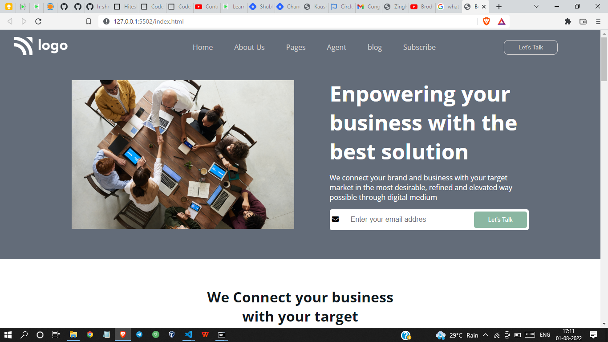

# Project 12 - HTML  and CSS 

By Shreesha

Here's the Live Deployed Website of 

## Project 12  [DEPLOYED LINK](https://project12-business-landing-page.netlify.app/)

# What did I learn in this project

- I got to learn about the linear gradient.
- I got to learn about the positioning of containers. 
- Got to learn about the flexbox.

## Time taken to complete project is 7 hours
